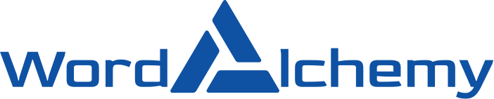

# WordAlchemy

**WordAlchemy** is a simple sveltkit app that can be used to learn, pronounce and look up for a new words.
It is a Dictionary app which mixed IPA (_International Phonetic Alphabet_) and word list.

# Languages are available

| Language | Status |
| -------- | ------ |
| English  | SOON   |
| Spanish  | SOON   |
| French   | SOON   |

# Note

This Project meant for eductional purposes only.
It is created under the passion and love of human language and also the power of programming languages. Thus, it is not meant to be used for any commercial purposes.

# Contributors

